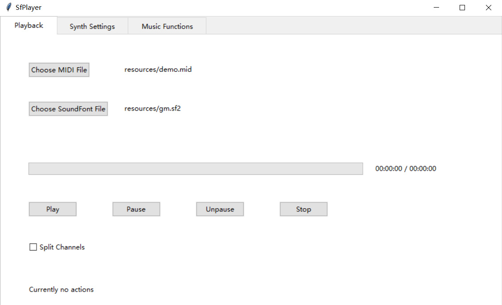
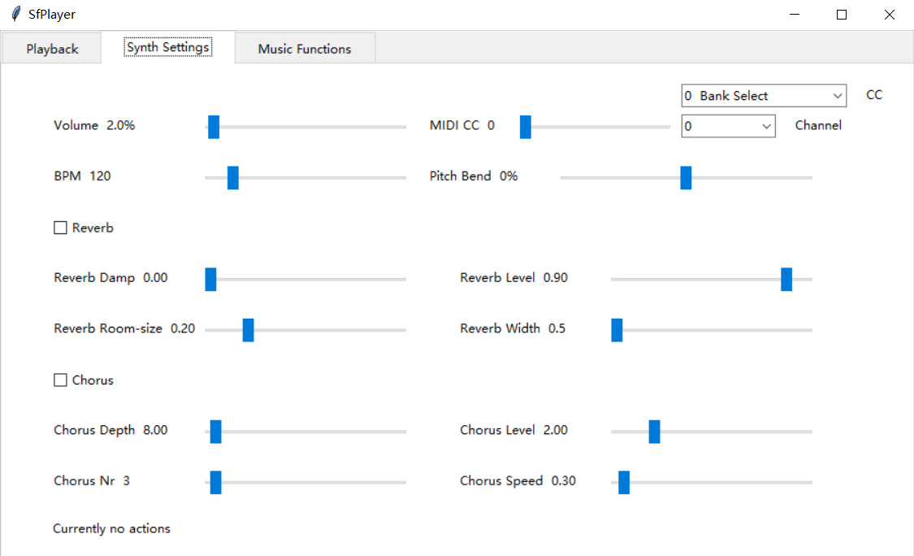
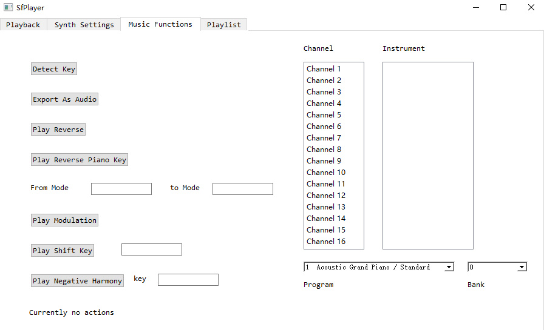

# SfPlayer

## Introduction

SfPlayer is a simple SoundFont player that has the following functionality:

* Loading MIDI files and SoundFont files, play MIDI files with the loaded SoundFont files
* Drag and drop support of MIDI files and SoundFont files
* Support Standard MIDI File (SMF) and RIFF MIDI file for MIDI files, sf2 / sf3 / dls for SoundFont files
* MIDI playback bar with full time control and pause / unpause / stop functionality
* Volume and BPM control widgets
* MIDI CC and pitch bend control widgets
* Tempo changes in MIDI file reflect directly on the BPM control bar
* Reverb and chorus parameters control widgets
* Change the instruments of MIDI channels to what you like when playing
* Program changes in MIDI file reflect directly on the instrument box
* Export rendered audio of MIDI file with the SoundFont file it plays with to mp3 / wav / ogg files and so on
* Detect the most possible main key of the MIDI file using music theory algorithm
* Perform an entire modulation from a mode to another mode on the MIDI file and play
* Play the MIDI file in reverse
* Play the MIDI file as if it is played on a 88-key piano but the piano keys are reversed
* More functionality is on the way!

## Usage

SfPlayer currently only supports Windows.

Click on `Choose MIDI File` button to select a MIDI file, click on `Choose SoundFont File` button to select a SoundFont file, and then click on `Play` button to start the playing of the MIDI file using the SoundFont file. You can also drag and drop the MIDI file and SoundFont file to the window, it will automatically detect the file extension and load as MIDI file or SoundFont file.

Go to different panes by selecting on tabs at the top to use functionality related to the pane's name.

## Download

Click [here](https://github.com/Rainbow-Dreamer/SfPlayer/archive/refs/heads/main.zip) to download the latest version of SfPlayer.

## TODO

* Adding more functionality related to music theory algorithm
* Make the user interface more organized and straightforward

## Previews

