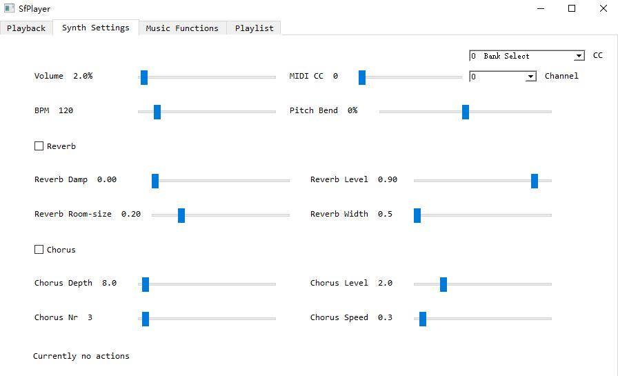

# SfPlayer

## Introduction

SfPlayer is a simple SoundFont player that has the following functionality:

* Loading MIDI files and SoundFont files, play MIDI files with the loaded SoundFont files
* Drag and drop support of MIDI files and SoundFont files
* Support Standard MIDI File (SMF) and RIFF MIDI file for MIDI files, sf2 / sf3 / dls for SoundFont files
* MIDI playback bar with full time control and pause / unpause / stop functionality
* Volume and BPM control widgets
* MIDI CC and pitch bend control widgets
* Tempo changes in MIDI file reflect directly on the BPM control bar
* Reverb and chorus parameters control widgets
* Change the instruments of MIDI channels to what you like when playing
* Program changes in MIDI file reflect directly on the instrument box
* Export rendered audio of MIDI file with the SoundFont file it plays with to mp3 / wav / ogg files and so on
* Detect the most possible main key of the MIDI file using music theory algorithm
* Perform an entire modulation from a mode to another mode on the MIDI file and play
* Play the MIDI file in reverse
* Play the MIDI file as if it is played on a 88-key piano but the piano keys are reversed
* More functionality is on the way!

## Usage

### Platform

SfPlayer currently only supports Windows.

### Switching pages

Go to different pages by selecting on tabs at the top to use functionality related to the page's name.

### Playback

Click on `Choose MIDI File` button to select a MIDI file, click on `Choose SoundFont File` button to select a SoundFont file, and then click on `Play` button to start the playing of the MIDI file using the SoundFont file. 

You can also drag and drop the MIDI file and SoundFont file to the window, it will automatically detect the file extension and load as MIDI file or SoundFont file.

Click on the `Play` button to start playing the MIDI file with the loaded SoundFont file, the other playing related button are used in the way they name.

Click on the playback bar or mouse drag to change the current playing position of the MIDI file.

Turn the `Split Channels` button on to do special split channels operation when the MIDI file has all of the channels on a single track.

### Synth Settings

This part is straightforward, for the control parameters like `MIDI CC` or `pitch bend`, when you select a new MIDI CC value or new channel number, the values will be updated as the current control value of the channel.

The `Volume` control widget is the general volume of the synth used to play the MIDI file with the loaded SoundFont file.

The `BPM` control widget will be automatically updated as the real-time BPM of the MIDI file when playing.

### Music Functions

The current instrument of each channel of the MIDI file when playing is shown in the `Instrument` box here, you can click on the `Channel` box to select a channel number, the current program and bank of the channel will be shown in the `Program` and `Bank` box.

You can change the current program and bank of the selected channel in the `Program` and `Bank` box.

In the `Instrument` box, the instrument names are the actual preset name of the corresponding program in the SoundFont file you use to play, while the instrument names in the `Instrument` box are the corresponding program names of the General MIDI standard.

For modulation of the MIDI file, you can enter modes like `C major` in the `From mode` and `to Mode` entry box, the note name supports both uppercase and lowercase, sharp and flat, but you need to make sure to have a space between the note name and the mode name. The supported modes are defined in `packages/musicpy/database.py` as the parameter `scaleTypes`, you can customize the supported modes by adding the new mode with the mode name and the intervals.

### Messages

The message at the bottom is used for showing errors when users are not doing correct.

## Download

Click [here](https://github.com/Rainbow-Dreamer/SfPlayer/archive/refs/heads/main.zip) to download the latest version of SfPlayer.

## TODO

* Adding more functionality related to music theory algorithm
* Make the user interface more organized and straightforward

## Previews

