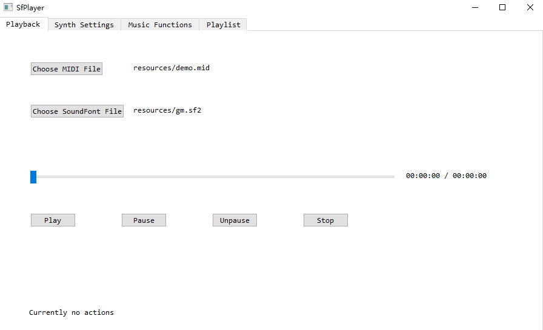

# SfPlayer
## Introduction

SfPlayer is a simple SoundFont player that has the following functionality:

* Loading MIDI files and SoundFont files, play MIDI files with the loaded SoundFont files

* MIDI playback bar with full control and pause / unpause / stop functionality

* Drag and drop support of MIDI files and SoundFont files

* Support Standard MIDI File (SMF) and RIFF MIDI file format for MIDI files, sf2 / sf3 / dls for SoundFont files

* Export rendered audio of MIDI file with the SoundFont file it plays with to mp3 / wav / ogg files and so on

* Detect the most possible main key of the MIDI file using music theory algorithm

* Custom the instruments of each track of the MIDI file using for playback

* Perform an entire modulation from a mode to another mode on the MIDI file and play

* More functionality is on the way!

  

## Usage

SfPlayer currently only supports Windows.

Click on `Choose MIDI File` button to select a MIDI file, click on `Choose SoundFont File` button to select a SoundFont file, and then click on `Play` button to start the playing of the MIDI file using the SoundFont file. You can also drag and drop the MIDI file and SoundFont file to the window, it will automatically detect the file extension and load as MIDI file or SoundFont file.

## Previews

## TODO

* Adding SoundFont and MIDI related parameters control widgets
* Adding more functionality related to music theory algorithm
* Make the user interface more organized and straightforward

